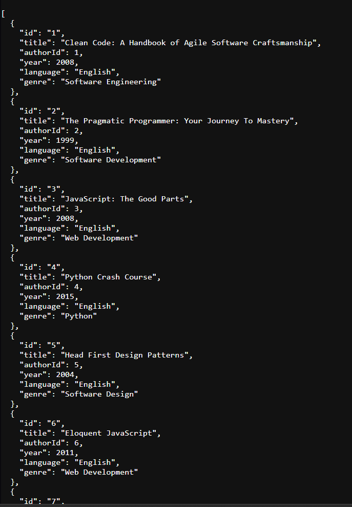
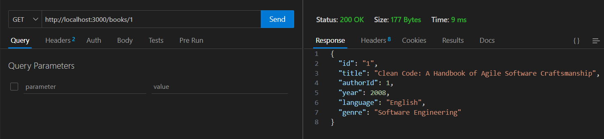
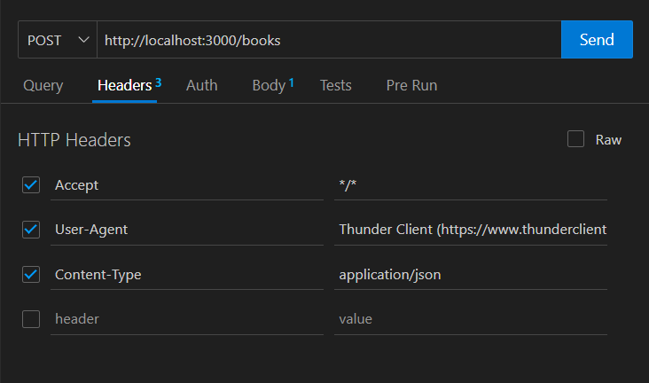
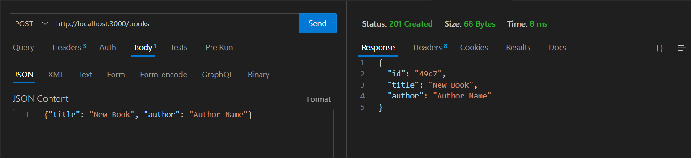
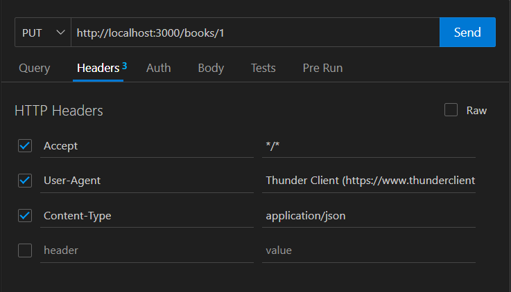
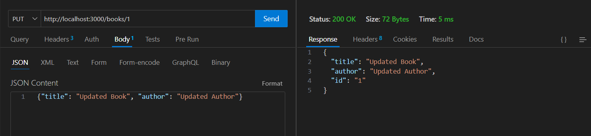
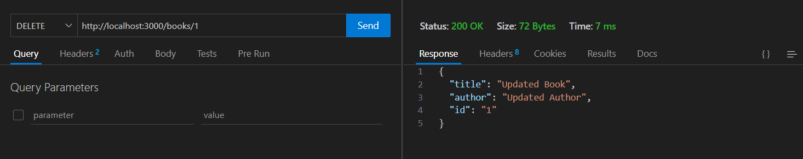
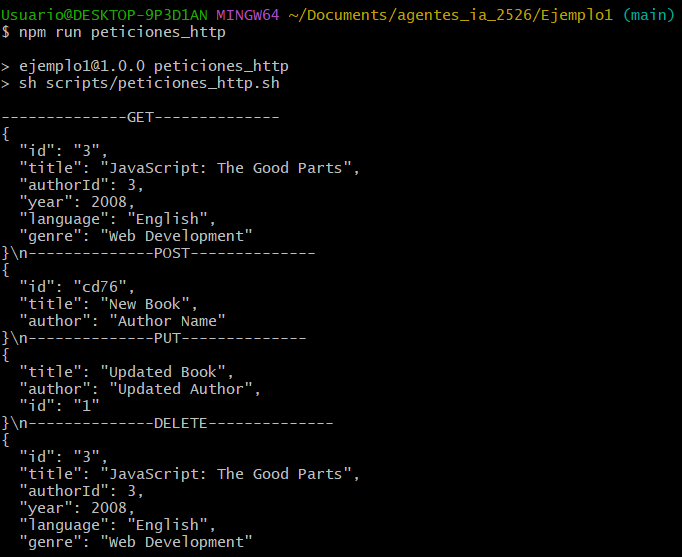

# TAREA

> Crear un CRUD usando la api que se acaba de crear.
> Crear un CRUD de peticiones usando thunderclient.
> Hacer un script dentro de la carpeta scripts, que haga un CRUD usando curl. Dicho script se llamada peticiones_http.sh.
> Crear una entrada en el package.json para que lance el script.
> Crear un README.md con un checklist (en markdown) que permita demostrar los dos ejercicios, incluyendo capturas de pantalla.

## **CHECKLIST**

- [x] Crear un CRUD usando la api que se acaba de crear.
- [x] Crear un CRUD de peticiones usando thunderclient.
- [x] Hacer un script dentro de la carpeta scripts, que haga un CRUD usando curl.
- [x] Crear una entrada en el package.json para que lance el script.
- [x] Crear un README.md con un checklist que permita demostrar los dos ejercicios.

## **TAREA RESUELTA**

En primer lugar, vamos a crear el script en el package.json, donde añadiremos para iniciar nuestro json-server y el .sh para ejecutar de seguido todas las peticiones del script peticiones_http.sh.

Una vez creados los scrips de lanzar-json-server y peticiones_http, pasamos a hacer nuestras peticiones con ThunderClient.

Debemos confirmar que nuestro servicio se abre correctamente ejecutando el script, y que en el navegador podemos observar nuestros datos:

### GET

Confirmamos que nos devuelve el resultado correspondiente.

### POST

Confirmamos que nos devuelve el resultado correspondiente.

### PUT

Confirmamos que nos devuelve el resultado correspondiente.

### DELETE

Confirmamos que nos devuelve el resultado correspondiente.

## **SCRIPT**

Es hora de pasar al script de ejecución. En este caso, vamos a crear un archivo en la carpeta scripts, llamado peticiones_http.sh
el cual va a ejecutar los comandos de CURL correspondientes.

Una vez finalizado el archivo, podemos ejecutar el archivo en la consola y demostrar que se muestran correctamente todos los resultados, asegurandonos de que todo funciona a la perfección.

