# Script CURL

Las variables arriba lo que hacen es coger las variables que hay en el .env y crea un baseUrl para utilizarlo. Para ello, primero se debe importar el dotenv a principio del script.

Las letras significan:
-H Header (El encabezado)
-d data (El cuerpo que se le va a pasar)
-X el método que se va a utilizar

En esta primera parte del código, lo que hacemos es que creamos una URL la cuál será utilizada en cada método.

```bash
import dotenv from "dotenv";
dotenv.config();

const baseUrl = `${process.env.API_BASE_URL}:${process.env.PORT}/students`;
```

Seguidamente, tenemos el resto del código, cada apartado con su respectiva función y en caso de ser necesario, cada uno tiene su data o su Header, con su respectivo contenido.

# REST Client

En primer lugar cogemos las variables, donde guardaremos tanto la URL base, el puerto, la apiURl, que en este caso lo que nos pide es usar students, por lo que conectamos la baseUrl con el puerto, seguido de una barra para dirigirnos a los estudiantes en concreto.
También guardaremos el contentType, que es para que la aplicación entienda que será JSON.

# Sección CRUD

Algunos de los requisitos previos que debemos tener en cuenta son:

1. Levantar el servidor de json-server:
   `npm run server:up`
   Saco los datos de la base de datos (db.json) para que la URL http://localhost:4000 escuche. Usamos esa URL porque es donde hemos señalado en server:up que corra json-server.

2. Tener las variables de enterno (.env) correctas para que el crud-curl.js pueda utilizarlas.

# Como usar Thunder Client

Thunder Client permite probar APIs Rest en el ediot, muy útil para enviar peticiones HTTP (GET, POST, PUT, PATCH, DELETE) a un servidor y ver las respuestas.

Después de instalarlo en VS Studio Code, usamos la opción New Request para crear una nueva petición.
A continuación, podremos rellenar los campos principales:

- Method (operación GET, POST, PUT, PATH, DELETE... )
- Reques URL: la URL, en este caso http://localhost:4000/students

Le damos a SEND para ejecutar la petición.

Tambien, podemos añadir Headers, normalmente usaremos:

- Content-Type: application/json
  Indica el formato de los datos que envias
- Accept: application/json
  Indica el formato en el que quieres recibir la respuesta

En el Body es el cuerpo de la petición donde ponemos para qué sirve es clave cuando trabajas con APIs. Es lo que se le manda al servidor para que trabaje con ello

## CREATE

Añade un nuevo estudiante a la base de datos. Usando el método POST se envian los datos del estudiante, se generará una ID y devuelve tanto el recurso creado como un código 201 Created.

Utilizamos el método POST porque es usado para crear un nuevo recurso dentro de una colección existente, por lo que señalamos con el comando crear un nuevo estudiante dentro de la colección students (Por ello ponemos /students, así le indicamos a json-server que añada el estudiante dentro del array "students").

`POST /students HTTP/1.1 Host: localhost:4000 Content-Type: application/json`

### Thunder Client CREATE

El header Content-Type indica el formato del contenido que enviaremos al cuerpo de la petición, en esete caso pedimos JSON, así el servidor sabe como interpretar la información.

Al ser una operación POST el body contiene los datos del recurso que queremos crear, en este caso las propiedades de un estudiante. No incluiremos id porque json-server lo genera automáticamente.

Devuelve un código 201 Created indicando que se ha creado correctamente en el servidor y lo guarda en en la base de datos.

![ThunderClientCreatedHeader]
![ThunderClientCreated]

### Rest Client CREATE

En esta primera comprobación, usamos POST para saber que queremos crear un estudiante, lo seguimos `de la apiUrl para indicar que se enviará ahí y del método HTTP, que será el 1.1 y le ponemos el Header de Content-Type, para indicar que será JSON. Seguidamente, le pasamos todo el usuario que queremos crear.
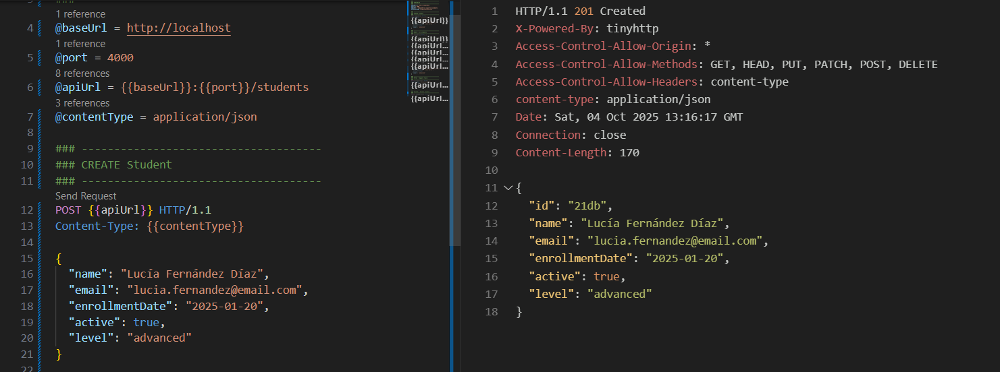

## READ ALL

Consulta la lista completa de estudiantes almacenados en la base de datos. Usando el método GET (leer recursos) sin parámetros, obtiene un array de objetos con todos los registros existentes. Se responderá con un OK (200) y el listado.

En el headers poner Accept: application/json porque se indica que aceptamos respuestas de JSON.

### Thunder Client READ ALL

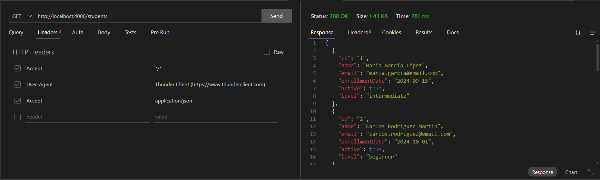

### REST Client READ ALL

Utilizamos GET para obtener todos los estudiantes, para eso, lo seguimos de la apiUrl para saber todo lo que debemos leer y del método HTTP.

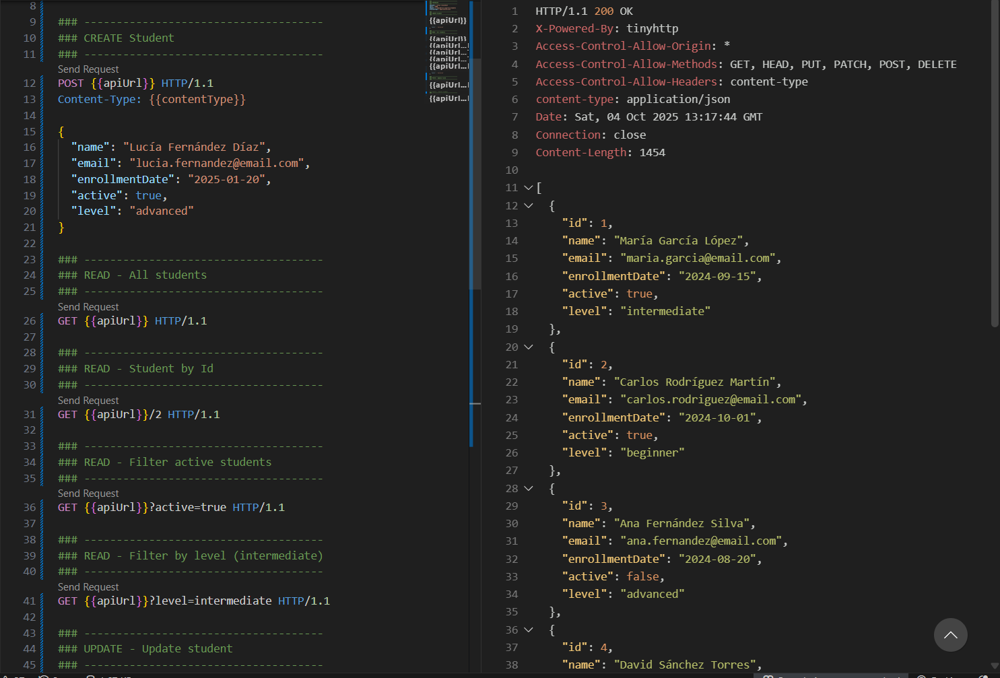

## READ BY ID

Consulta un estudiante concreto indicando su ID. Usando el método GET (Leer datos, no cambia de estado) y la URL donde debemos añadir al final /id con el id correspondiente. Si existe se devolverá un código 200 OK, si no, 404 Not Found.

En los headers podemos poner Accept: application/json para que espere JSON

### Thunder Client READ BY ID

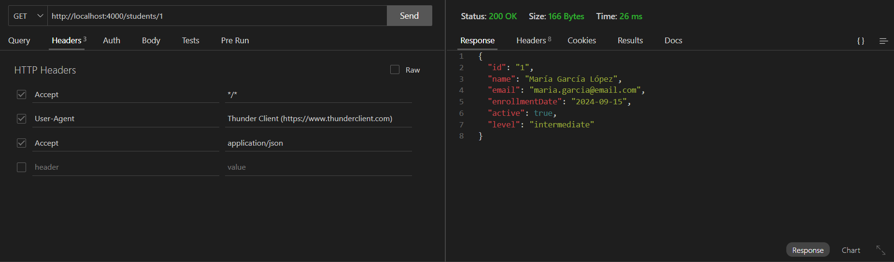

### REST Client READ BY ID

Usamos nuevamente el método GET, pero la diferencia ahora es que lo seguimos de un /2, para que nos muestre el segundo usuario, el que tiene id 2.

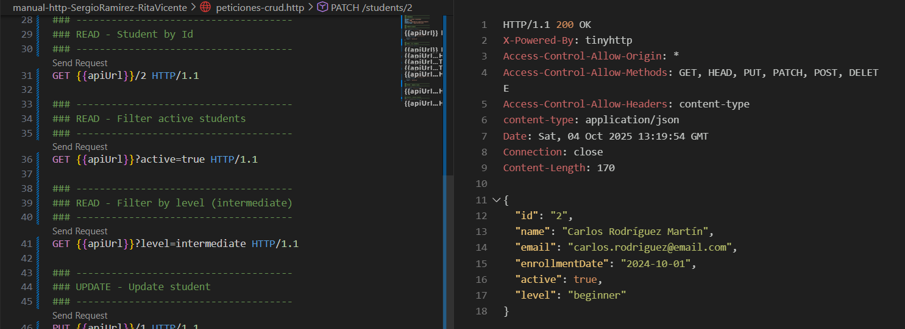

## UPDATE

Reemplaza completamente la información de un estudiante que ya existe. Usando el método PUT (reemplazar el recurso entero uno por uno, con las mismas claves. Sustituye el objeto completo, todo lo que no mandes desaparecerá)Enviando un objeto JSON con todos los campos, se sobreescribe y devuelve un 200 OK.
Se debe especificar el id de la URL.

En los headers debemos establecer el Content-Type: application/json para que sepa como interpretar el body y Accept: application/json para que responda con un JSON

### Thunder Client UPDATE

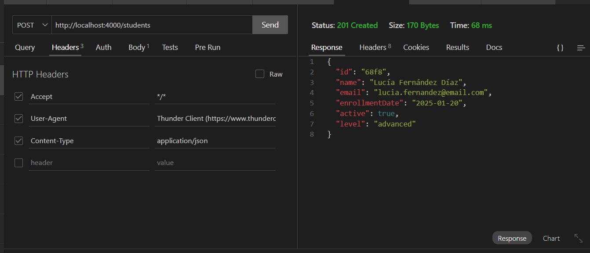

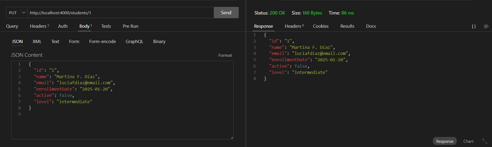

### REST Client UPDATE

La función de update sirve para actualizar un usuario.
Utilizamos el método PUT, seguido del id del usuario que queremos modificar, le pasamos el content-type y el nuevo usuario que queremos que se actualice al usuario con id elegido.


## PATCH

Modifica parcialmente un estudiante, se utiliza PATCH para cambiar solo algunos campos, modifica solo las claves enciadas y el resto las conservará. Devolverá un 200 OK.
Se debe especificar el id al final de la URL.

En los headers debemos establecer el Content-Type: application/json para que sepa como interpretar el body y Accept: application/json para que responda con un JSON

Se debe especificar el id del estudiante en la URL

### Thunder Client Patch

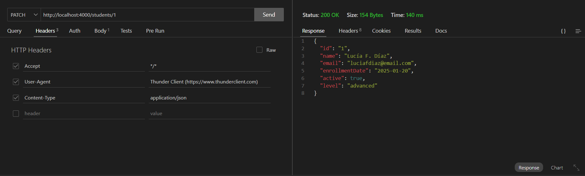
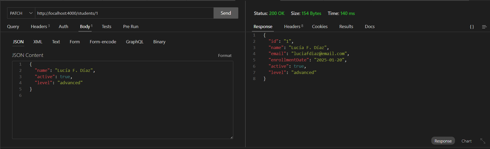

### REST Client PATCH

Aqui, utilizaremos el método PATCH, que dado un id de usuario nos permitirá actualizar los campos que nosotros prefiramos, en este caso, utilizamos el usuario con id 2 y le actualizamos el campo de nivel a advanced. Hay que pasarle el Header Content-Type para que se pa que lo que le vamos a pasar es un JSON.
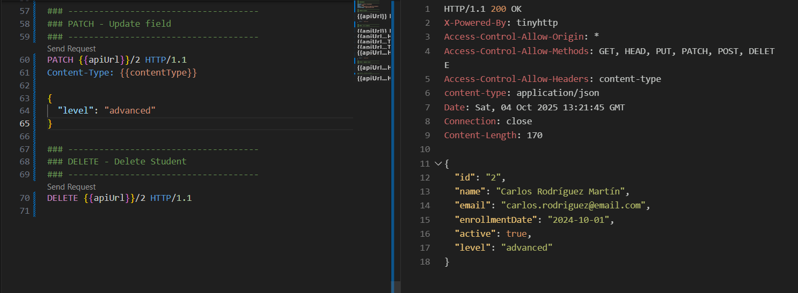

## DELETE

Elimina un estudiante de la base de datos indicano su ID. Devolvera un 200 OK, un 204 Not Content o si el ID no exxiste un 404 Not Found.

En los headers se puede poner Accept: application/json

Se debe especificar el id del estudiante en la URL.

### Thunder Client DELETE

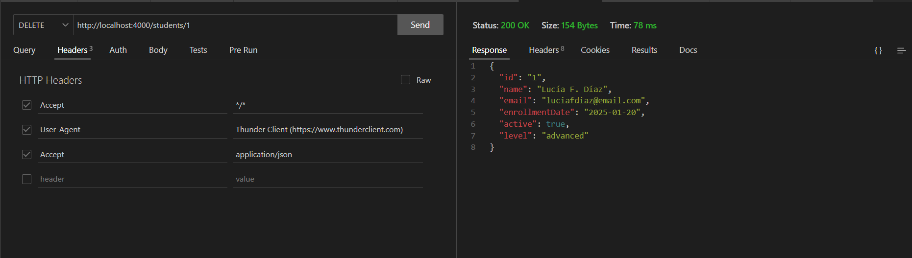

### REST Client DELETE

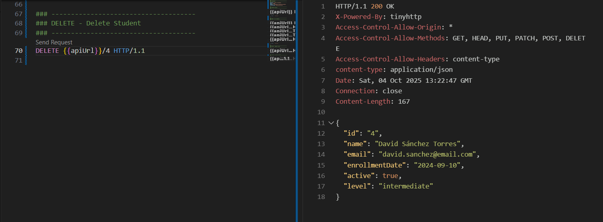

# Script de validación

El objetivo del script es verificar que el proyecto cumple con la estructura y requisitos mínimos antes de entrgarlo. Por lo que comprobará archivos, carpetas y configuraciones del proyecto.

Primero se verifica si existen los archivos y carpetas:

Con la funcion check_exists recibe una ruta de archivo o carpeta como parámetro, verifica si existe (-e) y muestra un mensaje si está presente o marca un error. Con ello, aseguraremos la estructura mínima del proyecto para que este completa y evitemos errores de ruta.

```bash
# --- Verify existence of files and folders---
check_exists() {
  if [ -e "$1" ]; then
    echo "Exists: $1"
  else
    echo "ERROR NOT FOUND: $1"
    PASS=false
  fi
}

# --- Verify files and folders ---
check_exists "package.json"
check_exists "src/db/db.json"
check_exists ".gitignore"
check_exists ".env.example"
check_exists "README.md"
check_exists "checklist.md"
check_exists "peticiones-crud.http"
check_exists "src/"
check_exists "src/crud-curl.js"
check_exists "images/"
check_exists "scripts/"
```

A continuación, se verifica el package.json:

Usando el comando grep el script analizará que esten instaladas las dependecias adecuadas (en este caso dotenv y json-server) y que existen los scripts principales (server:up, crud:curl) etc..

```bash
# --- Verify package.json ---
if grep -q '"type": "module"' package.json; then
  echo "CORRECT: package.json contains type: module"
else
  echo "ERROR: Miss type: module in package.json"
  PASS=false
fi

if grep -q '"dotenv"' package.json; then
  echo "CORRECT: Dependency dotenv found"
else
  echo "ERROR: Dependency dotenv not found"
  PASS=false
fi

if grep -q '"json-server"' package.json; then
  echo "CORRECT: Dependency json-server found"
else
  echo "ERROR: Dependency json-server not found"
  PASS=false
fi

if grep -q '"server:up"' package.json; then
  echo "CORRECT: Script server:up found"
else
  echo "ERROR: Script server:up not found"
  PASS=false
fi

if grep -q '"crud:curl"' package.json; then
  echo "CORRECT: Script crud:curl found"
else
  echo "ERROR: Script crud:curl not found"
  PASS=false
fi
```

Se verifican las imagenes:
Buscará en la carpeta images las capturas correspondientes a ThunderClient que deben estar en formato .jpg o .png
Las cuenta usando find para asegurarse que hay al menos 6 imágenes.

```bash
# --- Verify images ---
IMG_COUNT=$(find images -type f -name "ThunderClient*.jpg" -o -name "ThunderClient*.png" | wc -l)
if [ "$IMG_COUNT" -ge 6 ]; then
  echo "CORRECT: Found $IMG_COUNT in images/"
else
  echo "ERROR: Just found $IMG_COUNT images, required at least 6"
  PASS=false
fi
```

Resultado final:
Si está todo correcto se mostrará el mensaje de VALIDATION COMPLETED y saldra con exit 0, en caso contrario se mostrará VALIDATION FAILED y devolerá exit 1.

```bash
# --- Final result ---
echo "-----------------------------------"
if [ "$PASS" = true ]; then
  echo "VALIDATION COMPLETED"
  exit 0
else
  echo "VALIDATION FAILED"
  exit 1
fi
```
