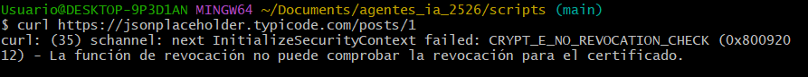
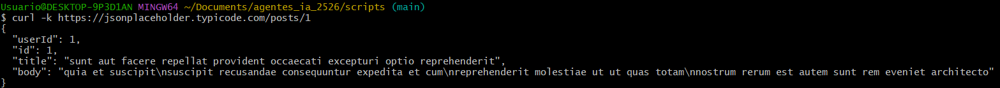
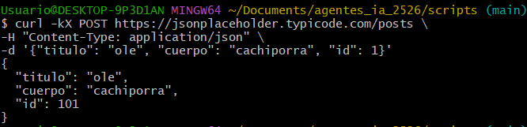
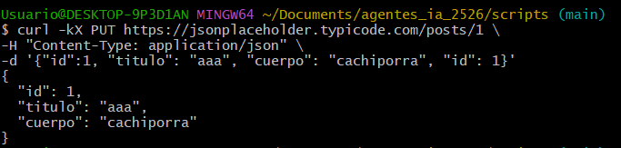
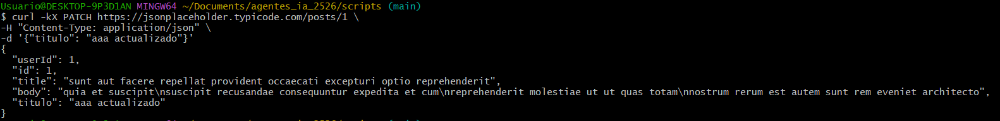
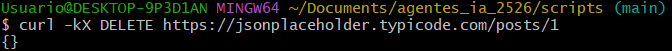
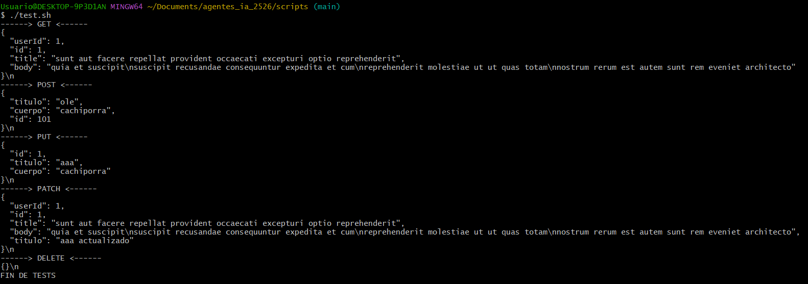

# TAREA CURL

- Crear un documento que ejemplifique todas las posibles opciones del comando CURL.
- Usar alguna web API REST fake para probar las posibles funcionalidades del comando CURL (https://jsonplaceholder.typicode.com)
- Crear script llamado test. /scripts/test.sh que lance todas las posibles test del comando CURL para realizar GET, POST, DELETE, PATCH y PUT.

### TAREA RESUELTA

#### OPCIONES

- -k: sirve para omitir verificacion de certificados, la cual no nos permite ver el resultado en terminal.
  
- -X: Indicar el método que queremos usar (POST/GET/PUT/...).
- -H: Indicar que se están enviando datos JSON al servidor. Tambien puede escribirse como --header.
  > No usar -H puede derivar a que la API nos devuelva un error si no comprende lo que estamos queriendo decirle
- -d: Enviar información al servidor, es la reduccion de "data". En resumen, los datos que se envian al servidor.
- -i: Mostrar encabezados de respuesta. (Muestra tamaño, codigo de estado, etc...)
- -v: Mostrar información sobre lo que va realizando la petición.

## 1. GET

Solicita información del servidor, por ejemplo, abajo, estamos solicitando el post número 1.

```bash
curl -k https://jsonplaceholder.typicode.com/posts/1
```



## 2. POST

Envia datos para crear algo nuevo

```bash
curl -kX POST https://jsonplaceholder.typicode.com/posts \
-H "Content-Type: application/json" \
-d '{"titulo": "ole", "cuerpo": "cachiporra", "id": 1}'
```



## 3. PUT

Actualiza algo con los nuevos datos introducidos

```bash
curl -kX PUT https://jsonplaceholder.typicode.com/posts/1 \
-H "Content-Type: application/json" \
-d '{"id":1, "titulo": "aaa", "cuerpo": "cachiporra", "id": 1}'
```



## 4. PATCH

Actualiza solo lo solicitado

```bash
curl -kX PATCH https://jsonplaceholder.typicode.com/posts/1 \
-H "Content-Type: application/json" \
-d '{"titulo": "aaa actualizado"}'
```



## 5. DELETE

Elimina del servidor

```bash
curl -kX DELETE https://jsonplaceholder.typicode.com/posts/1
```



# TESTS REALIZADOS

Comprobamos que todos los tests nos salgan exactamente como deben utilizando el script creado en /scripts/test.sh


